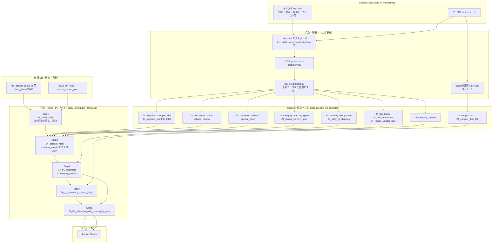

## データパイプライン（24Exp_daily PL monitoring）

```mermaid
flowchart TB
  subgraph EXCEL["Excel(24Exp_daily PL monitoring)"]
    XLS["各マスターシート<br/>POS・物流・取引先・カテゴリ等"]
    COUPON_X["クーポンリストシート"]
  end
  %% flowchart TB
  subgraph EXCEL["Excel（24Exp_daily PL monitoring）"]
    XLS["各マスターシート<br/>POS・物流・取引先・カテゴリ等"]
    COUPON_X["クーポンリストシート"]
  end

  subgraph MONTHLY["月次（所費・マスタ更新）"]
    BAS["VBA CSV エクスポート<br/>ExportAllLookerCsvsUnified.bas 等"]
    GCS["GCS gs://r-cm-cc-ichiba2/*.csv"]
    PY["csv_createtable.py<br/>（汎用テーブル化管理マスタ）"]
    COUPON_SQL["coupon関連クエリ.sql<br/>Step1〜3"]
  end

  subgraph BQ_DIM["BigQuery 月次マスタ spdb-sbx.sbx_icb_homelife"]
    D1["24_logistics_cost_per_sku<br/>24_logistics_monthly_total"]
    D2["24_pos_return_price / rebate / promo"]
    D3["24_customer_master / special_price"]
    D4["24_category_map_by_genre<br/>24_maker_convert_map"]
    D5["24_monthly_fee_params<br/>24_daily_pl_shipping"]
    D6["24_jbp_fund / md_aio_investment<br/>24_rebate_vendor_rate"]
    D7["24_category_master"]
    D8["24_coupon_list → 24_coupon_item_tbl"]
  end

  subgraph UA["市場 DB（日次・自動）"]
    UA1["red_basket_detail_tbl 等<br/>shop_id = 421663"]
    UA2["hl1p_jan_load / maker_master_load"]
  end

  subgraph DAILY["日次（GMS・PL マート）daily_scheduled_24Exp.sql"]
    S1["Step1<br/>24_sales_daily<br/>3か月洗い直し＋保持"]
    S2["Step2<br/>24_dataset_mart<br/>business_month でマスタ JOIN"]
    S3["Step3<br/>24_PL_datamart<br/>+ category_master"]
    S4["Step4<br/>24_pl_datamart_coupon_daily"]
    S5["Step5<br/>24_PL_datamart_with_coupon_by_item"]
  end

  subgraph OUT["ダッシュボード"]
    LS["Looker Studio"]
  end

  XLS --> BAS --> GCS --> PY --> D1 & D2 & D3 & D4 & D5 & D6 & D7
  COUPON_X --> BAS
  COUPON_X --> COUPON_SQL --> D8

  UA1 --> S1
  UA2 --> S1
  S1 --> S2
  D1 & D2 & D3 & D4 & D5 & D6 --> S2
  S2 --> S3
  D7 --> S3
  S3 --> S4
  D8 --> S4
  S4 --> S5
  S3 --> S5
  S5 --> LS

  S5 --> LS
```
